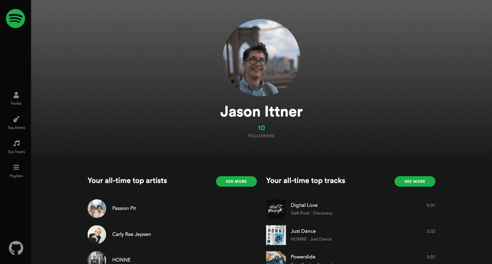
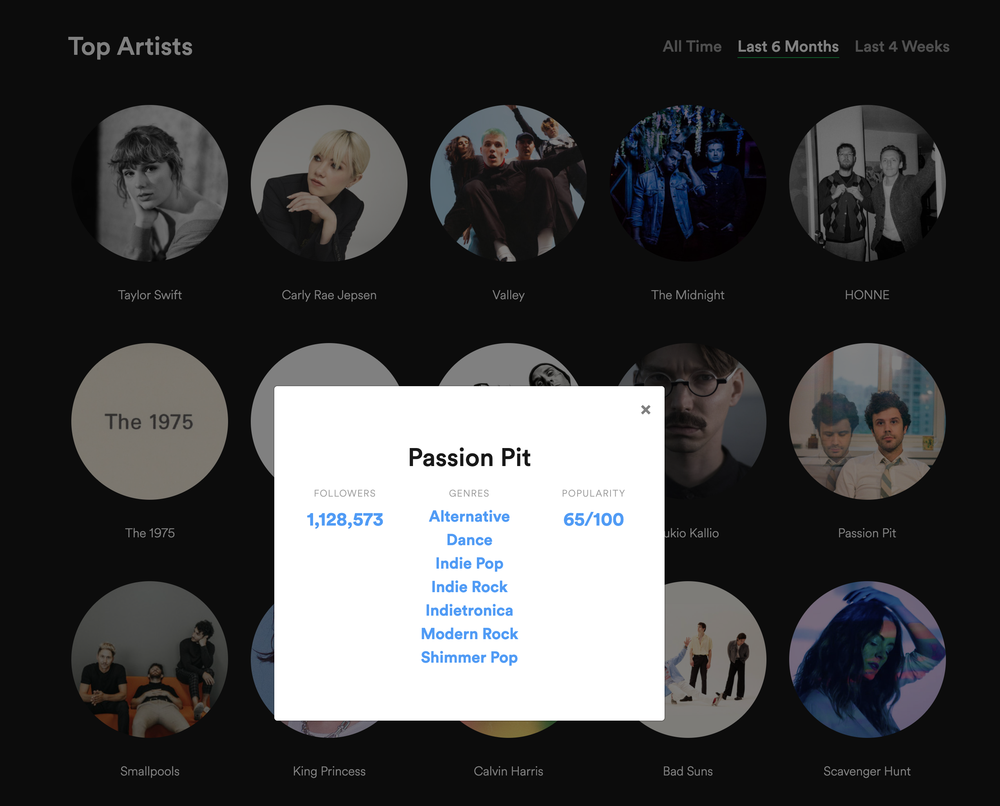
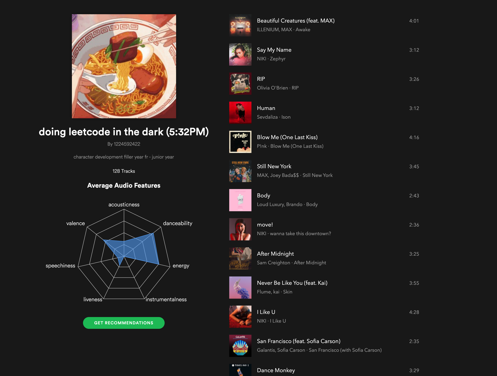
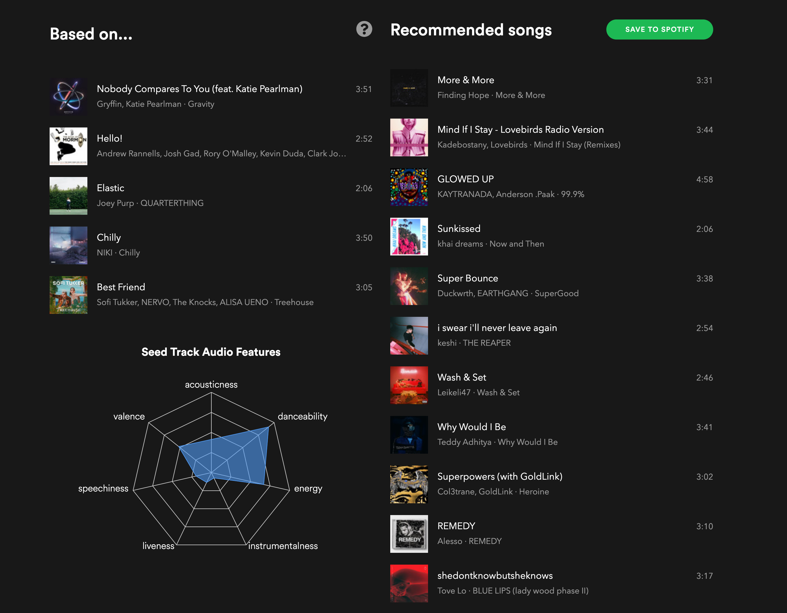

# Toolify
### Useful tools for Spotify :v:
___

Neat features:
* View your top artists and songs over different ranges of time
* See info about your top artists
* Visualize the average audio attributes of your playlists
* Get song recommendations based on your playlists
    * Add those recommendations to a new playlist directly from the page

Future features (backend already implemented):
* Check your playlists for duplicate songs
* Copy songs from one playlist to another
* Get recommendations based on your top artists and tracks
## [Try it out!](https://my-toolify.herokuapp.com)
*(You'll need third party cookies enabled, and the first visit might take a bit to load if the Heroku app is idle)*
___

___
## Built with:
* Spotify API
* React
    * React Router
    * React Bootstrap
    * Styled Components
    * Recharts
* Flask
    * Flask Dance
* Heroku

